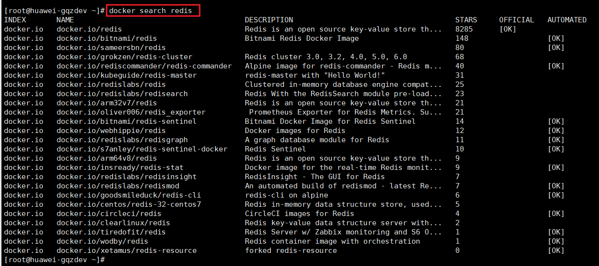
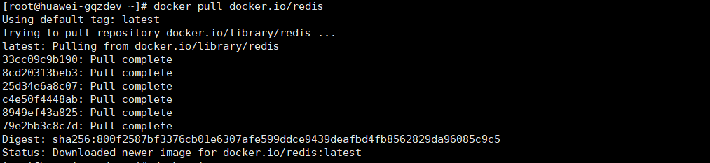
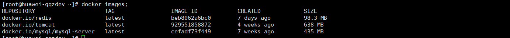
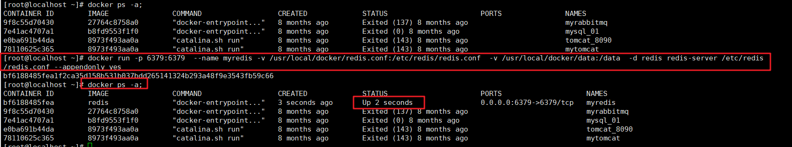
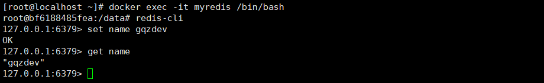

# spring-boot-start-cache-redis

> Spring Boot 整合 redis，操作redis中的数据，并使用redis缓存数据。连接池使用  Lettuce。

## 安装Redis

### Docker 安装 Redis


1. 搜索Docker中的redis镜像

   ```bash
   docker search redis
   ```

   

2. 获取 redis 镜像  (注意切换为阿里的镜像)

```bash
docker pull redis;
```


\* 不加版本号默认获取最新版本

3. 查看本地镜像

```bash
docker images;
```



从官网获取 [redis.conf](http://download.redis.io/redis-stable/redis.conf) 配置文件

- 修改默认配置文件
  - bind 127.0.0.1  #注释掉这部分，这是限制redis只能本地访问
  - protected-mode no  #默认yes，开启保护模式，限制为本地访问
  - daemonize no  #默认no，改为yes意为以守护进程方式启动，可后台运行，除非kill进程（可选），改为yes会使配置文件方式启动redis失败
  - dir  ./ #输入本地redis数据库存放文件夹（可选）
  - appendonly yes #redis持久化（可选）

4. docker 启动 redis 命令

```bash
docker run -p 6379:6379  --name myredis -v /usr/local/docker/redis.conf:/etc/redis/redis.conf  -v /usr/local/docker/data:/data  -d redis redis-server /etc/redis/redis.conf --appendonly yes
```

- 命令解释说明：
  - -p 6379:6379 端口映射： 前表示主机部分，：后表示容器部分。
  - --name myredis  指定该容器名称，查看和进行操作都比较方便。
  - -v 挂载目录，规则与端口映射相同。
  - -d redis 表示后台启动redis
  - redis-server /etc/redis/redis.conf  以配置文件启动redis，加载容器内的conf文件，最终找到的是挂载的目录/usr/local/docker/redis.conf
  - appendonly yes 开启redis 持久化

5. 使用docker ps 查看myredis已经运行了
   

6. 使用` docker exec -it myredis /bin/bash` 进入redis
   

7. 使用 redis-cli 可以测试连接

### Linux环境安装 Redis

**安装步骤**

1. 下载获得redis-3.2.5.tar.gz后将它放入我们的Linux目录/opt

 2.解压命令:tar -zxvf redis-3.2.5.tar.gz

 3.解压完成后进入目录:cd redis-3.2.5

 4.在redis-3.2.5目录下执行make命令

> 运行Make命令时出现错误,提示 gcc：命令未找到 ，
>
> 原因是因为当前Linux环境中并没有安装gcc 与 g++ 的环境

5.安装gcc与g++

> 能上网的情况:	yum install gcc         yum install gcc-c++


**查看默认安装目录** **/usr/local/bin**

- Redis-benchmark:  性能测试工具，可以在自己本子运行，看看自己本子性能如何(服务启动起来后执行)
- Redis-check-aof：修复有问题的AOF文件，rdb和aof后面讲
- Redis-check-dump：修复有问题的dump.rdb文件
- Redis-sentinel：Redis集群使用
- redis-server：Redis服务器启动命令
- redis-cli：客户端，操作入口


**Redis**的启动

- 默认前台方式启动
- 直接执行redis-server 即可.启动后不能操作当前命令窗口
- 推荐后台方式启动
- 拷贝一份redis.conf配置文件到其他目录，例如根目录下的myredis目录  /myredis
- 修改redis.conf文件中的一项配置 `daemonize` 将no 改为yes，代表后台启动
- 执行配置文件进行启动 执行 `redis-server /myredis/redis.conf`

```bash
[root@txserver /]# redis-server /opt/myRedis/redis.conf 
9276:C 21 May 2020 23:28:32.830 # oO0OoO0OoO0Oo Redis is starting oO0OoO0OoO0Oo
9276:C 21 May 2020 23:28:32.830 # Redis version=5.0.8, bits=64, commit=00000000, modified=0, pid=9276, just started
9276:C 21 May 2020 23:28:32.830 # Configuration loaded
```


**客户端访问**

- 使用`redis-cli` 命令访问启动好的Redis
- 如果有多个Redis同时启动，则需指定端口号访问  `redis-cli -p 端口号`
- 测试验证,通过 `ping 命令` 查看是否 返回 PONG


**关闭Redis服务**

- 单实例关闭
- 如果还未通过客户端访问，可直接 `redis-cli shutdown`
- 如果已经进入客户端,直接 shutdown即可.
- 多实例关闭
- 指定端口关闭 `redis-cli -p 端口号 shutdown`


**设置开机启动Redis**


1、编写脚本

```bash
vim /etc/init.d/redis
```

2、内容如下

```bash
# chkconfig: 2345 10 90  
# description: Start and Stop redis     
PATH=/usr/local/bin:/sbin:/usr/bin:/bin   #找到本机安装redis后，存放redis命令的目录  
REDISPORT=6379                            #redis的默认端口， 要和下文中的redis.conf中一致
EXEC=/usr/redisbin/redis-server           #redis服务端的命令
REDIS_CLI=/usr/redisbin/redis-cli         #redis客户端的命令  这两个一般都在 PATH目录下
PIDFILE=/var/run/redis.pid                #reids的进程文件生成的位置
CONF="/usr/redisbin/redis.conf"           #redis的配置文件所在的目录 
#AUTH="1234"  这句没什么用可以不要  
 
case "$1" in   
        start)   
                if [ -f $PIDFILE ]   
                then   
                        echo "$PIDFILE exists, process is already running or crashed."  
                else  
                        echo "Starting Redis server..."  
                        $EXEC $CONF   
                fi   
                if [ "$?"="0" ]   
                then   
                        echo "Redis is running..."  
                fi   
                ;;   
        stop)   
                if [ ! -f $PIDFILE ]   
                then   
                        echo "$PIDFILE exists, process is not running."  
                else  
                        PID=$(cat $PIDFILE)   
                        echo "Stopping..."  
                       $REDIS_CLI -p $REDISPORT  SHUTDOWN    
                        sleep 2  
                       while [ -x $PIDFILE ]   
                       do  
                                echo "Waiting for Redis to shutdown..."  
                               sleep 1  
                        done   
                        echo "Redis stopped"  
                fi   
                ;;   
        restart|force-reload)   
                ${0} stop   
                ${0} start   
                ;;   
        *)   
               echo "Usage: /etc/init.d/redis {start|stop|restart|force-reload}" >&2  
                exit 1  
esac
```

3、设置redis 权限

```bash
chmod 755 /etc/init.d/redis
```

4、启动redis

```bash
/etc/init.d/redis start
```

5、设置开机启动

```bash
cd /etc/init.d/
chkconfig redis on
```


## pom.xml

```xml
<?xml version="1.0" encoding="UTF-8"?>
<project xmlns="http://maven.apache.org/POM/4.0.0" xmlns:xsi="http://www.w3.org/2001/XMLSchema-instance"
         xsi:schemaLocation="http://maven.apache.org/POM/4.0.0 http://maven.apache.org/xsd/maven-4.0.0.xsd">
    <modelVersion>4.0.0</modelVersion>

    <artifactId>spring-boot-start-cache-redis</artifactId>
    <version>1.0.0-SNAPSHOT</version>
    <packaging>jar</packaging>

    <name>spring-boot-start-cache-redis</name>
    <description>Demo project for Spring Boot</description>

    <parent>
        <groupId>com.gqzdev</groupId>
        <artifactId>spring-boot-start</artifactId>
        <version>1.0.0-SNAPSHOT</version>
    </parent>

    <properties>
        <project.build.sourceEncoding>UTF-8</project.build.sourceEncoding>
        <project.reporting.outputEncoding>UTF-8</project.reporting.outputEncoding>
        <java.version>1.8</java.version>
    </properties>

    <dependencies>
        <dependency>
            <groupId>org.springframework.boot</groupId>
            <artifactId>spring-boot-starter</artifactId>
        </dependency>

        <dependency>
            <groupId>org.springframework.boot</groupId>
            <artifactId>spring-boot-starter-data-redis</artifactId>
        </dependency>

        <!-- 对象池，使用redis时必须引入 -->
        <dependency>
            <groupId>org.apache.commons</groupId>
            <artifactId>commons-pool2</artifactId>
        </dependency>

        <!-- 引入 jackson 对象json转换 -->
        <dependency>
            <groupId>org.springframework.boot</groupId>
            <artifactId>spring-boot-starter-json</artifactId>
        </dependency>

        <dependency>
            <groupId>org.springframework.boot</groupId>
            <artifactId>spring-boot-starter-test</artifactId>
            <scope>test</scope>
        </dependency>

        <dependency>
            <groupId>com.google.guava</groupId>
            <artifactId>guava</artifactId>
        </dependency>

        <dependency>
            <groupId>cn.hutool</groupId>
            <artifactId>hutool-all</artifactId>
        </dependency>

        <dependency>
            <groupId>org.projectlombok</groupId>
            <artifactId>lombok</artifactId>
            <optional>true</optional>
        </dependency>
    </dependencies>

    <build>
        <finalName>spring-boot-demo-cache-redis</finalName>
        <plugins>
            <plugin>
                <groupId>org.springframework.boot</groupId>
                <artifactId>spring-boot-maven-plugin</artifactId>
            </plugin>
        </plugins>
    </build>

</project>
```

## application.yml

```yaml
spring:
  redis:
    host: localhost
    # 连接超时时间（记得添加单位，Duration）
    timeout: 10000ms
    # Redis默认情况下有16个分片，这里配置具体使用的分片
    # database: 0
    lettuce:
      pool:
        # 连接池最大连接数（使用负值表示没有限制） 默认 8
        max-active: 8
        # 连接池最大阻塞等待时间（使用负值表示没有限制） 默认 -1
        max-wait: -1ms
        # 连接池中的最大空闲连接 默认 8
        max-idle: 8
        # 连接池中的最小空闲连接 默认 0
        min-idle: 0
  cache:
    # 一般来说是不用配置的，Spring Cache 会根据依赖的包自行装配
    type: redis
logging:
  level:
    com.xkcoding: debug
```

## RedisConfig.java

```java
/**
 * redis配置
 */
@Configuration
@AutoConfigureAfter(RedisAutoConfiguration.class)
@EnableCaching
public class RedisConfig {

    /**
     * 默认情况下的模板只能支持RedisTemplate<String, String>，也就是只能存入字符串，因此支持序列化
     */
    @Bean
    public RedisTemplate<String, Serializable> redisCacheTemplate(LettuceConnectionFactory redisConnectionFactory) {
        RedisTemplate<String, Serializable> template = new RedisTemplate<>();
        template.setKeySerializer(new StringRedisSerializer());
        template.setValueSerializer(new GenericJackson2JsonRedisSerializer());
        template.setConnectionFactory(redisConnectionFactory);
        return template;
    }
}
```

## UserServiceImpl.java

```java
/**
 * UserService
 */
@Service
@Slf4j
public class UserServiceImpl implements UserService {
    /**
     * 模拟数据库
     */
    private static final Map<Long, User> DATABASES = Maps.newConcurrentMap();

    /**
     * 初始化数据
     */
    static {
        DATABASES.put(1L, new User(1L, "user1"));
        DATABASES.put(2L, new User(2L, "user2"));
        DATABASES.put(3L, new User(3L, "user3"));
    }

    /**
     * 保存或修改用户
     *
     * @param user 用户对象
     * @return 操作结果
     */
    @CachePut(value = "user", key = "#user.id")
    @Override
    public User saveOrUpdate(User user) {
        DATABASES.put(user.getId(), user);
        log.info("保存用户【user】= {}", user);
        return user;
    }

    /**
     * 获取用户
     *
     * @param id key值
     * @return 返回结果
     */
    @Cacheable(value = "user", key = "#id")
    @Override
    public User get(Long id) {
        // 我们假设从数据库读取
        log.info("查询用户【id】= {}", id);
        return DATABASES.get(id);
    }

    /**
     * 删除
     *
     * @param id key值
     */
    @CacheEvict(value = "user", key = "#id")
    @Override
    public void delete(Long id) {
        DATABASES.remove(id);
        log.info("删除用户【id】= {}", id);
    }
}
```

## RedisTest.java

> 主要测试使用 `RedisTemplate` 操作 `Redis` 中的数据：
>
> - opsForValue：对应 String（字符串）
> - opsForZSet：对应 ZSet（有序集合）
> - opsForHash：对应 Hash（哈希）
> - opsForList：对应 List（列表）
> - opsForSet：对应 Set（集合）
> - opsForGeo：** 对应 GEO（地理位置）

```java
/**
 * Redis测试
 */
@Slf4j
public class RedisTest extends SpringBootDemoCacheRedisApplicationTests {

    @Autowired
    private StringRedisTemplate stringRedisTemplate;

    @Autowired
    private RedisTemplate<String, Serializable> redisCacheTemplate;

    /**
     * 测试 Redis 操作
     */
    @Test
    public void get() {
        // 测试线程安全，程序结束查看redis中count的值是否为1000
        ExecutorService executorService = Executors.newFixedThreadPool(1000);
        IntStream.range(0, 1000).forEach(i -> executorService.execute(() -> stringRedisTemplate.opsForValue().increment("count", 1)));

        stringRedisTemplate.opsForValue().set("k1", "v1");
        String k1 = stringRedisTemplate.opsForValue().get("k1");
        log.debug("【k1】= {}", k1);

        // 以下演示整合，具体Redis命令可以参考官方文档
        String key = "gqzdev:user:1";
        redisCacheTemplate.opsForValue().set(key, new User(1L, "user1"));
        // 对应 String（字符串）
        User user = (User) redisCacheTemplate.opsForValue().get(key);
        log.debug("【user】= {}", user);
    }
}

```

## UserServiceTest.java

> 主要测试使用Redis缓存是否起效

```java
/**
 * Redis - 缓存测试
 */
@Slf4j
public class UserServiceTest extends SpringBootDemoCacheRedisApplicationTests {
    @Autowired
    private UserService userService;

    /**
     * 获取两次，查看日志验证缓存
     */
    @Test
    public void getTwice() {
        // 模拟查询id为1的用户
        User user1 = userService.get(1L);
        log.debug("【user1】= {}", user1);

        // 再次查询
        User user2 = userService.get(1L);
        log.debug("【user2】= {}", user2);
        // 查看日志，只打印一次日志，证明缓存生效
    }

    /**
     * 先存，再查询，查看日志验证缓存
     */
    @Test
    public void getAfterSave() {
        userService.saveOrUpdate(new User(4L, "user4"));

        User user = userService.get(4L);
        log.debug("【user】= {}", user);
        // 查看日志，只打印保存用户的日志，查询是未触发查询日志，因此缓存生效
    }

    /**
     * 测试删除，查看redis是否存在缓存数据
     */
    @Test
    public void deleteUser() {
        // 查询一次，使redis中存在缓存数据
        userService.get(1L);
        // 删除，查看redis是否存在缓存数据
        userService.delete(1L);
    }

}
```

## 参考

- spring-data-redis 官方文档：https://docs.spring.io/spring-data/redis/docs/2.0.1.RELEASE/reference/html/
- redis 文档：https://redis.io/documentation
- redis 中文文档：http://www.redis.cn/commands.html
